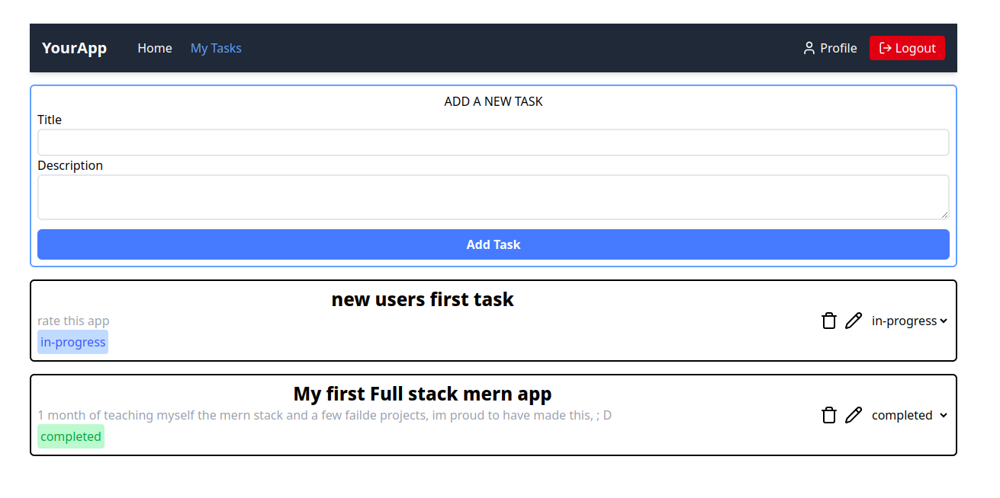

# 📝 MERN To-Do App  
A simple task management application built with **MongoDB, Express.js, React, and Node.js**.

## 🚀 Features  
- ✅ Add, edit, and delete tasks  
- ✅ create accounts 
- ✅ login with jwt and cookies authentication
- ✅ Mark tasks as completed  
- ✅ Store tasks in MongoDB  
- ✅ Responsive UI with React  
- ✅ RESTful API with Express.js  


## 📸 Screenshots  
  

---

## 🛠️ Installation  

### **1️⃣ Clone the Repository**
```sh
git clone https://github.com/Elixir-Piloting/MERN-TODO.git
cd MERN-TODO.git
```
---
### **install the server dependancies**

```sh
cd server
npm i
```
---
#### **Configure your .env**
```sh
DB_URI = your_mongodb_url
PORT = your_port
DEV = true
JWT_SECRET=your_jwt_secret
SECRET=your_app_secret
SALT = 10
```

### **Start the server**
#### for dev server
```sh
npm start dev #for dev 
```
#### for production server
```sh
npm start #for production
```

---

### **install the client dependancies**

```sh
cd ../client
npm i
```
---

### **Start the client server**
```sh
npm run dev
```
---
## **🤝 Contributing**
Fork the repository

Create a feature branch 
```sh
git checkout -b feature-name
```

Commit your changes 
```sh
git commit -m "Added feature X"
```

Push to GitHub 
```sh
git push origin feature-name
```
Open a Pull Request
---
---
## **🛡️ License**
This project is licensed under the MIT License.


